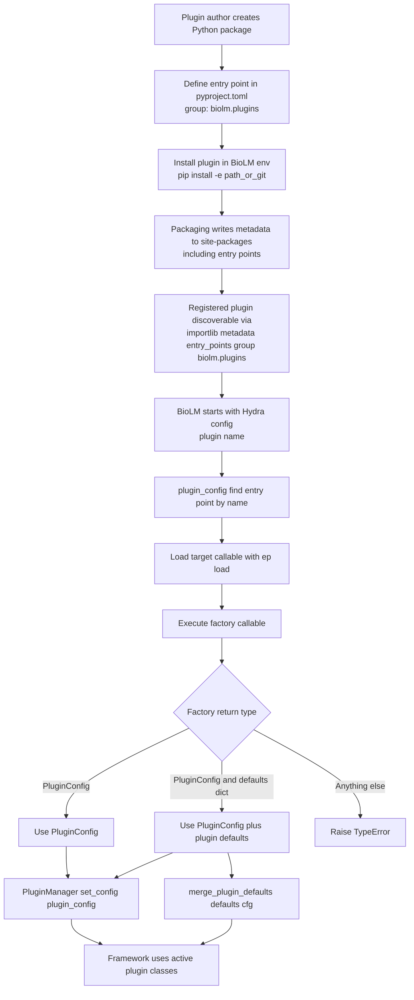

# BioLM Plugin Contract (Detailed)

This document explains exactly how BioLM plugins are installed, discovered, and loaded at runtime.

---

## 0) Quick re-entry checklist (returning after a while)

If you are coming back to the project after months, run this sequence first:

1. Go to framework root (Poetry will manage the environment for commands below).

```bash
cd /prj/RNA_NLP/biolm_utils
```

2. Check framework + plugin visibility.

```bash
poetry run biolm --help
poetry run biolm list-plugins
```

3. Reinstall Saluki from the correct branch (safe/idempotent if already present).

```bash
poetry run biolm install-plugin "https://github.com/dieterich-lab/rna_saluki_cnn.git?ref=saluki-2.0"
```

4. Sanity-check entry-point discovery.

```bash
poetry run python -c "import importlib.metadata as m; print([e.name for e in m.entry_points(group='biolm.plugins')])"
```

5. Run a quick health test set.

```bash
poetry run pytest tests/integration/test_plugin_discovery.py
```

If step 3 fails with "not a Python project", you are likely on an old branch/layout. Re-run using `?ref=saluki-2.0`.

---

## 1) Mental model

A BioLM plugin is a normal Python package that exposes one entry point in the `biolm.plugins` group.

### What is a “Python plugin” in this project?

In BioLM, a plugin is **not** a special file format and **not** a custom registry object.
It is simply:

- a standard installable Python package (with `pyproject.toml`),
- that declares one callable under `[tool.poetry.plugins."biolm.plugins"]`,
- where that callable returns BioLM runtime configuration (`PluginConfig`).

So “plugin registration” means: **package metadata registration via entry points during installation**.
BioLM later reads that metadata and loads the callable.

At runtime, BioLM:

1. reads installed entry points from the active Python environment,
2. finds the plugin named in config (`plugin: <name>`),
3. imports and calls the plugin factory,
4. stores the returned `PluginConfig`, and
5. merges optional plugin defaults into Hydra config.

So the key mechanism is Python package metadata + entry points, not a custom registry file.

---

## 1.1) Exact registration flow (install time vs runtime)



### Install time (registration happens here)

1. Plugin author defines entry point in plugin `pyproject.toml`.
2. Plugin is installed in the active BioLM environment (`pip install -e ...`).
3. Installer writes package metadata (including entry points) into environment site-packages.

At this point, plugin is *registered* and discoverable via:

```python
importlib.metadata.entry_points(group="biolm.plugins")
```

### Runtime (loading/activation happens here)

1. BioLM reads config value `plugin: <name>`.
2. `biolm.plugin_config._find_entry_point(<name>)` scans entry points in group `biolm.plugins`.
3. Matching entry point is loaded with `ep.load()`.
4. Loaded callable (`factory`) is executed.
5. Return value must be either:
    - `PluginConfig`, or
    - `(PluginConfig, dict)` for optional Hydra defaults.
6. `PluginManager.set_config(plugin_config)` stores active plugin config.
7. If defaults dict was returned, `merge_plugin_defaults` merges defaults under user config.

Result: explicit user/Hydra overrides still take precedence.

---

## 2) Installation commands and what they do

BioLM CLI offers two plugin install modes:

### A. `install-plugin` (clone + editable install)

```bash
poetry run biolm install-plugin <git-url>
```

Branch pinning is supported in one line:

```bash
poetry run biolm install-plugin "https://github.com/dieterich-lab/rna_saluki_cnn.git?ref=saluki-2.0"
```

Equivalent shorthand for HTTPS URLs:

```bash
poetry run biolm install-plugin "https://github.com/dieterich-lab/rna_saluki_cnn.git@saluki-2.0"
```

Under the hood (`biolm/plugin_manager.py`):

- clones repo into `plugins/<repo-name>` (uses `git clone -b <ref> --single-branch` when ref given),
- runs `python -m pip install -e <plugin-path>`.

### B. `develop-plugin` (local path + editable install)

```bash
poetry run biolm develop-plugin /path/to/plugin/repo
```

Under the hood:

- no clone,
- runs `python -m pip install -e /path/to/plugin/repo`.

Use this during active plugin development.

---

## 3) Why editable install (`pip -e`) matters

`pip install -e` registers package metadata in environment site-packages (including entry points), while code stays in your working tree.

That gives you:

- immediate code updates without reinstalling,
- discoverability via `importlib.metadata.entry_points(group="biolm.plugins")`.

---

## 4) Runtime discovery flow (step by step)

### Step 1: Plugin registration in package metadata

Your plugin must declare entry point in its `pyproject.toml`:

```toml
[tool.poetry.plugins."biolm.plugins"]
saluki = "saluki_plugin.config:get_saluki_config"
```

### Step 2: BioLM sees installed plugins

`biolm list-plugins` and runtime code call:

```python
importlib.metadata.entry_points(group="biolm.plugins")
```

This returns installed entry points from active env.

### Step 3: BioLM loads selected plugin factory

In `biolm/plugin_config.py`:

- `_find_entry_point(plugin_name)` finds matching entry point,
- `ep.load()` imports target callable,
- `factory()` is executed.

### Step 4: Factory return is normalized

Factory may return:

- `PluginConfig`, or
- `(PluginConfig, dict)` tuple.

`dict`-only returns are no longer part of the supported contract.

BioLM validates the return shape and sets active config via `PluginManager.set_config(...)`.

### Step 5: Hydra config merge

If plugin provides defaults dict, BioLM merges it beneath explicit Hydra config (`merge_plugin_defaults`).

Meaning: user overrides still win.

---

## 5) Required plugin contract

A valid plugin package must provide:

1. Installable Python project at repo root (`pyproject.toml` or `setup.py`).
2. Entry point in group `biolm.plugins`.
3. Factory function importable from entry point target.
4. Factory must return a usable `PluginConfig` (optionally together with a defaults dict).
    Supported return types:
    - `PluginConfig`
    - `(PluginConfig, dict)` where `dict` contains optional plugin defaults for Hydra merge

Minimal factory example:

```python
from biolm.plugin_config import PluginConfig, PluginManager
from transformers import PreTrainedTokenizerFast
from transformers.data.data_collator import DefaultDataCollator

from my_plugin.dataset import MyDataset
from my_plugin.models import MyModel


def get_my_plugin_config():
    cfg = PluginConfig(
        model_cls_for_pretraining=None,
        model_cls_for_finetuning=MyModel,
        dataset_cls=MyDataset,
        tokenizer_cls=PreTrainedTokenizerFast,
        datacollator_cls_for_pretraining=None,
        datacollator_cls_for_finetuning=DefaultDataCollator,
        pretraining_required=False,
        add_special_tokens=False,
        learning_rate=1e-4,
        max_grad_norm=1.0,
        weight_decay=0.0,
    )
    PluginManager.set_config(cfg)
    return cfg
```

---

## 6) Quick validation checklist for new plugin authors

After creating plugin:

1. Install in active BioLM env:

```bash
poetry run biolm develop-plugin /path/to/plugin
```

1. Verify discovery:

```bash
poetry run biolm list-plugins
```

1. Verify entry point programmatically:

```bash
python -c "import importlib.metadata as m; print([e.name for e in m.entry_points(group='biolm.plugins')])"
```

1. Verify factory contract manually (quick import test):

```bash
python -c "from saluki_plugin.config import get_saluki_config; x=get_saluki_config(); print(type(x))"
```

Expected: `PluginConfig` instance, or a 2-tuple where first element is `PluginConfig`.

1. Run focused tests:

- framework plugin-discovery tests,
- plugin’s own tests.

---

## 7) Common failure modes

### “does not appear to be a Python project”

The cloned branch/repo root lacks `pyproject.toml` or `setup.py`.

### Plugin not listed

- wrong environment,
- plugin not installed editable in this env,
- missing/incorrect entry point group (`biolm.plugins`).

### Entry point found but loading fails

- import path in entry point is wrong,
- missing dependency in plugin package,
- factory raises during execution.

---

## 8) Notes specific to Saluki

Use the active plugin branch (`saluki-2.0`) when installing from Git:

```bash
poetry run biolm install-plugin "https://github.com/dieterich-lab/rna_saluki_cnn.git?ref=saluki-2.0"
```

This avoids legacy-branch layout mismatches.

---

